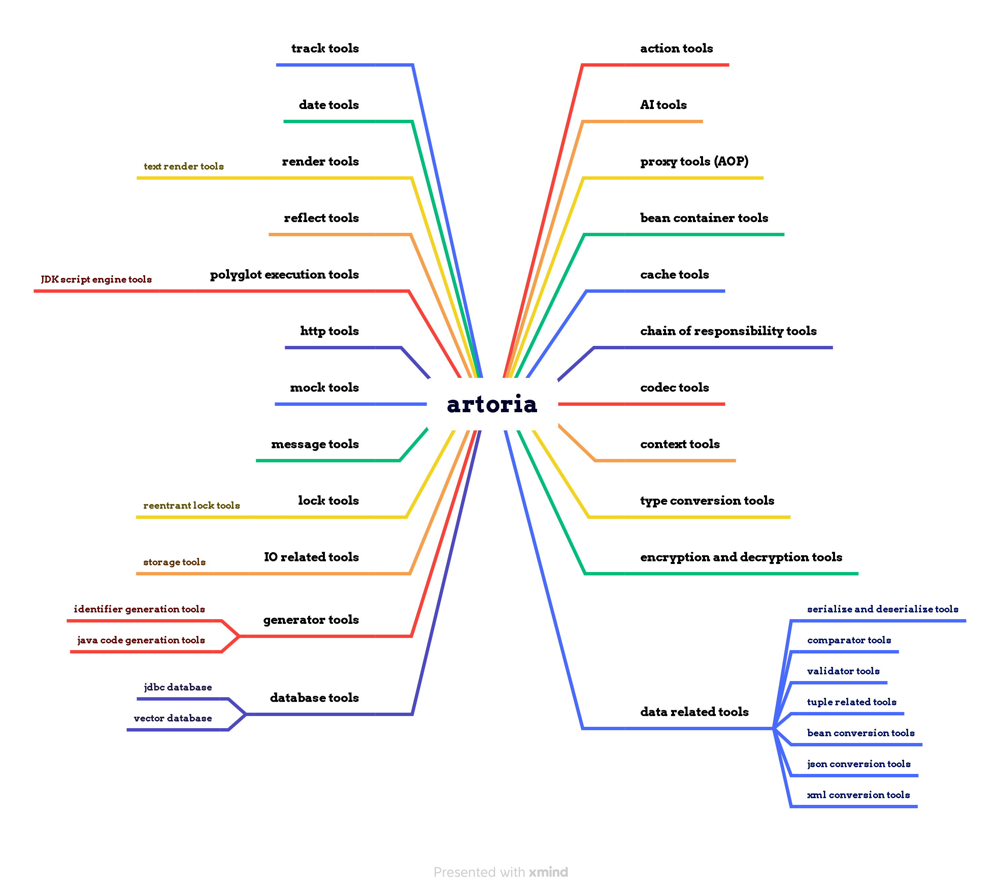

<h1 align="center">Artoria</h1>
<p align="center"><b>Artoria is a Java technology framework based on the Facade pattern.</b></p>
<p align="center"><b>English | <a href="documents/zh/README.md">中文</a></b></p>
<p><b>(All the English in this document has been translated using AI, for better understanding, it can be switched to Chinese.)</b></p>

# Introduction

Artoria is a Java technology framework based on the Facade pattern. Its design philosophy is to provide users with a unified interface for interaction with other modules through the Facade pattern. Users do not need to understand the implementation details of other modules, and they will not be coupled with a specific implementation, which is more conducive to extension and maintenance.
<br /><br /><br />

# Function Diagram


<br /><br /><br />

# Function List
Below, we will briefly introduce the functions and scenarios of various tools. For more detailed documentation, please refer to: https://github.com/kahle23/artoria-extend. (Since this project is considered a "Facade", there are fewer specific implementation classes; what's more important are its interfaces and utility classes). <br /><br /><br />

## Action Tools
What is an "Action"? In fact, any piece of program can be expressed as "fun(input) return output;", similar to the mathematical expression "f(x)". Here, I have defined it as "Action", and then given it a name. Therefore, whether it's extremely complex logic or simple logic, it can be invoked by "Action name + input parameters + variables that receive the output parameters". <br />
<br />
**Simple usage example (some example codes require pre-configuration or implementation):**

```java
// If the company's framework includes two types of order profit-sharing algorithms, "order-share1" and "order-share2"
OrderDTO order = ...;
// Calculation and filling of order profit-sharing information
ActionUtils.execute("order-share1", order, Object.class);
// If you want to use another profit-sharing algorithm, you just need to modify it as follows
ActionUtils.execute("order-share2", order, Object.class);
```
<br /><br /><br />


## AI Tools
What is AI? AI, short for Artificial Intelligence, refers to the intelligence displayed by systems created by humans. This intelligence manifests itself through learning, understanding, reasoning, problem-solving, perceiving the environment, recognizing language, and so on. Examples include Machine Learning (ML), Natural Language Processing (NLP), Optical Character Recognition (OCR), and others. <br />
<br />
**Simple usage example (some example codes require pre-configuration or implementation):**

```java
Dict args = Dict.of("model", "gpt-3.5-turbo-0613")
        .set("temperature", 1.9)
        .set("messages", Arrays.asList(
                Dict.of("role", "system").set("content", "You are a helpful assistant."),
                Dict.of("role", "user").set("content", "what is AI?"))
        )
;
String method = "chat";
Dict execute = AiUtils.execute("openai", args, method, Dict.class);
log.info("result: {}", JSON.toJSONString(execute, Boolean.TRUE));
```
<br /><br /><br />


## Proxy Tools
Proxy tools are essentially dynamic proxy object generation tools; they are tools used in the application of the Proxy design pattern. In this project, only the implementation class of the dynamic proxy based on JDK was realized. <br />
<br />
**Simple usage example (some example codes require pre-configuration or implementation):**

```java
HelloServiceImpl realHelloService = new HelloServiceImpl();
HelloService helloService = ProxyUtils.proxy(new AbstractInterceptor<HelloServiceImpl>(realHelloService) {
    @Override
    public Object intercept(Object proxyObject, Method method, Object[] args) throws Throwable {
        log.info("Proxy object's class is {}", proxyObject.getClass().getName());
        log.info("Hello, this is intercept. ");
        return method.invoke(getOriginalObject(), args);
    }
});
log.info(helloService.sayHello(name));
```
<br /><br /><br />


## Bean Container Tools
Based on the Bean container and dependency inversion is a very good design approach, so there is this Bean container tool, which allows the use of Bean container and dependency inversion related functions even in scenarios without a Spring container. <br />
<br />
**Simple usage example (some example codes require pre-configuration or implementation):**

```java
// No available
```
<br /><br /><br />


## Cache Tools
Cache tools are primarily used to enhance the speed of data access by storing copies of frequently used data to reduce retrieval time from the original storage. <br />
<br />
**Simple usage example (some example codes require pre-configuration or implementation):**

```java
String cacheName = "TEST";
CacheUtils.put(cacheName, "key1", "val1");
CacheUtils.put(cacheName, "key2", "val2");
log.info("{}", CacheUtils.get(cacheName, "key1"));
log.info("{}", CacheUtils.get(cacheName, "key2"));
```
<br /><br /><br />


## Chain Tools or Workflow Tools
A set of tools designed based on the responsibility chain and workflow, used for handling most scenarios where a responsibility chain or workflow can be applied.
For example:
- Approval processes (approval workflow);
- Various activities in e-commerce systems;

<br /><br />
**Simple usage example (some example codes require pre-configuration or implementation):**

```java
// No available
```
<br /><br /><br />


## Codec Tools
Encoding and decoding tools, such as Base64 encoding and decoding, Hex encoding and decoding, and Unicode encoding and decoding, etc. <br />
<br />
**Simple usage example (some example codes require pre-configuration or implementation):**

```java
// Base64 encoding and decoding
String encode = CodecUtils.encodeToString(BASE64, dataBytes);
log.info("Encode string: {}{}", NEWLINE, encode);
byte[] decode = CodecUtils.decodeFromString(BASE64, encode);
log.info("Decode string: {}{}", NEWLINE, new String(decode, "UTF-8"));
// Unicode encoding and decoding
String encode = CodecUtils.encode(UNICODE, "Hello，Java! ");
log.info(encode);
log.info(CodecUtils.decode(UNICODE, encode));
```
<br /><br /><br />


## Context Tools
When developing application services, information about the current logged-in user is generally placed in context tools. However, in this project, the context tool is a very top-level abstract design. <br />
<br />
**Simple usage example (some example codes require pre-configuration or implementation):**

```java
// No available
```
<br /><br /><br />


## Type Conversion Tools
In Java, scenarios often arise where you need to convert a string type like "16" into a numeric type like Integer 16. This is easy to handle in clear-cut cases. But what if the input parameter is an Object and you need to perform numerical calculations during business operations? Or perhaps the business operation only requires passing in the expected conversion type—this scenario becomes more complex. <br />

Especially when generics are involved, things can get even more complicated, such as converting from "List" to "PageList". These are the issues that the type conversion tool aims to address.<br />
<br />
**Simple usage example (some example codes require pre-configuration or implementation):**

```java
// String to Double conversion
Object obj = ConversionUtils.convert("102", double.class);
log.info("{} {}", obj.getClass(), obj);
// Time string to Date object conversion
Object obj = ConversionUtils.convert("2019-03-25 10:10:10 300", java.sql.Date.class);
log.info("{} {}", obj.getClass(), DateUtils.format((Date) obj));
```

<br /><br /><br />


## Encryption and Decryption Tools
Encryption and decryption tools include AES, DES, DESede, Blowfish, RSA, etc. As for Hash-related tools, there are MD2, MD5, SHA1, SHA256, etc. Hmac-related tools include HmacMD5, HmacSHA1, HmacSHA256, etc. <br />
<br />
**Simple usage example (some example codes require pre-configuration or implementation):**

```java
// No available
```
<br /><br /><br />


## Data related Tools
Data operation-related tools include serialization and deserialization tools, data comparison tools, tuple-related tools, etc. <br /><br />

### Serialize and Deserialize Tools
Serialization tools are the process of converting objects into a transportable or storable sequence of bytes, while deserialization tools are the process of restoring the byte sequence back into an object. <br />
<br />
**Simple usage example (some example codes require pre-configuration or implementation):**

```java
// No available
```
<br /><br />

### Comparator Tools
In Java, everything can be an object, so comparison tools can compare differences such as images, files, and data between two objects. Since collections like List are essentially also objects, they can also be used to compare the differences between multiple object data and among multiple objects. <br />
<br />
**Simple usage example (some example codes require pre-configuration or implementation):**

```java
// No available
```
<br /><br />

### Validator Tools
A validator tool checks if certain data (an object) conforms to the rules of a specific validator implementation class. The most classic example of a validator implementation class is one based on regular expressions. Therefore, a validator tool is essentially a set of tools that verify whether items like email addresses, bank cards, phone numbers, etc., are "correct". Of course, its greatest advantage is the ease with which it can be customized based on business needs. <br />
<br />
**Simple usage example (some example codes require pre-configuration or implementation):**

```java
log.info("{}", ValidatorUtils.validate("is_numeric", "-888.666"));
log.info("{}", ValidatorUtils.validate("is_numeric", "hello, world! "));
log.info("{}", ValidatorUtils.validate("regex:email", "hello@email.com"));
log.info("{}", ValidatorUtils.validate("regex:email", "hello@.com"));
log.info("{}", ValidatorUtils.validate("regex:phone_number", "12000000000"));
log.info("{}", ValidatorUtils.validate("regex:phone_number", "18000000000"));
```

<br /><br />

### Tuple related Tools
A tuple refers to objects like "KeyValue," "Pair," and "Triple," which are convenient for storing data. <br />
<br />
**Simple usage example (some example codes require pre-configuration or implementation):**

```java
KeyValue keyValue = new KeyValueImpl<String, Object>();
Triple triple = new TripleImpl<Object, String, Class<?>>();
```
<br /><br />

### Bean Conversion Tools
Bean conversion tools are used for copying property values between different types of Java objects (including Map). <br />
<br />
**Simple usage example (some example codes require pre-configuration or implementation):**

```java
Map<String, Object> personMap = ... ;
User person = ... ;
User user = BeanUtils.mapToBean(personMap, User.class);
User user = BeanUtils.beanToBean(person, User.class);
```

<br /><br />

### Json Conversion Tools
Json conversion tools are used for converting between Java objects and Json data. <br />
<br />
**Simple usage example (some example codes require pre-configuration or implementation):**

```java
String jsonString = JsonUtils.toJsonString("fastjson", data, PRETTY_FORMAT);
String jsonString = JsonUtils.toJsonString("jackson", data, PRETTY_FORMAT);
String jsonString = JsonUtils.toJsonString("gson", data, PRETTY_FORMAT);
```

<br /><br />

### Xml Conversion Tools
XML conversion tools are used for processing and manipulating XML data, enabling the conversion between XML data and Java objects. <br />
<br />
**Simple usage example (some example codes require pre-configuration or implementation):**

```java
Object[] arguments = new Object[] {
        new XmlFieldAlias("id", Student.class, "studentId"),
        new XmlFieldAlias("schName", Student.class, "schoolName"),
        new XmlClassAlias("student", Student.class),
        new XmlClassAlias("xml", List.class),
};
String xmlString = XmlUtils.toXmlString(list, arguments);
log.info("\n{}", xmlString);
List<Student> parseList = XmlUtils.parseObject(xmlString, List.class, arguments);
log.info("\n{}", JSON.toJSONString(parseList, true));
```

<br /><br /><br />


## Database Tools
Database operation-related tools. <br /><br />

### Jdbc Database Tools
Database operation tools based on native JDBC. <br />
<br />
**Simple usage example (some example codes require pre-configuration or implementation):**

```java
// No available
```
<br /><br />

### Vector Database Tools
Vector database operation tools (no implementation class). <br />
<br />
**Simple usage example (some example codes require pre-configuration or implementation):**

```java
// No available
```
<br /><br /><br />


## Generator Tools
Generator-related tools. <br /><br />

### Identifier Generation Tools
The ID generator tool is used to create unique identifiers (IDs), commonly employed to provide primary keys or unique identification for records in a database table. <br />
<br />
**Simple usage example (some example codes require pre-configuration or implementation):**

```java
Long snowflakeId = IdUtils.nextLong("snowflake");
String uuid = IdUtils.nextString("uuid");
```

<br /><br />

### Code Generation Tools
The code generator tool is used for automatically generating code snippets or files. It primarily employs a template engine, using a template-filling approach to inject data into pre-made code templates for code generation. Therefore, the code fragments or files it can generate entirely depend on the prepared code templates. <br />
<br />
**Simple usage example (some example codes require pre-configuration or implementation):**

```java
// No available
```
<br /><br /><br />


## IO related Tools
IO-related tools. <br /><br />

### Storage Tools
Storage tools are used for storing and managing data, similar to Object Storage Services, but they also include local storage capabilities. <br />
<br />
**Simple usage example (some example codes require pre-configuration or implementation):**

```java
// This is just an example, and the configuration part is omitted.
File inputFile = new File("/test/input_file.txt");
String testPath = "/test/test_file.txt";
// Save the file to a local folder.
StorageUtils.put("local", testPath, inputFile);
// Save the file to HuaWei cloud OBS.
StorageUtils.put("obs",   testPath, inputFile);
// Save the file to Ali cloud OSS.
StorageUtils.put("oss",   testPath, inputFile);
// Save the file to MinIO.
StorageUtils.put("minio", testPath, inputFile);
```

<br /><br /><br />


## Lock Tools
Lock tools are primarily used to achieve synchronization and mutual exclusion control between multiple threads, ensuring the safe access of shared resources. <br /><br />

### Reentrant Lock Tools
Based on Java's ReentrantLock implementation, it is a local reentrant exclusive lock. <br />
<br />
**Simple usage example (some example codes require pre-configuration or implementation):**

```java
String managerName = "local", lockName = "testLock";
boolean tryLock = LockUtils.tryLock(managerName, lockName);
Assert.isTrue(tryLock, "Try lock failure! ");
try {
    // Do something.
}
finally {
    LockUtils.unlock(managerName, lockName);
}
```

<br /><br /><br />


## Message Tools
Message tools are used to implement communication mechanisms (asynchronous or synchronous) between applications (such as server and client) or internal components within an application (between Service A and Service B). <br /><br /><br />


## Mock Tools
Mock tools are automation tools used for creating a large quantity of well-formatted test data for software development and testing purposes. <br />
<br />
**Simple usage example (some example codes require pre-configuration or implementation):**

```java
Book book = MockUtils.mock(Book.class);
log.info(JSON.toJSONString(book, Boolean.TRUE));
List<Book> bookList = MockUtils.mock(TypeUtils.parameterizedOf(List.class, Book.class));
log.info(JSON.toJSONString(bookList, Boolean.TRUE));
```

<br /><br /><br />


## Net Tools
Network-related tools focus on providing network-related functions, aiming to simplify network programming and make it easier for developers to handle network tasks. <br /><br />

### Http Tools
Http tools are used for sending and receiving HTTP requests, providing the ability to communicate with Web services. <br />
<br />
**Simple usage example (some example codes require pre-configuration or implementation):**

```java
String testUrl = "https://info.cern.ch";
HttpResponse response = HttpUtils.execute(new SimpleRequest(testUrl, HttpMethod.GET));
log.info(response.getBodyAsString());
```
<br /><br /><br />


## Polyglot Execution Tools
Multilingual execution tools enable the mechanism to execute other programming languages besides Java itself on the Java platform, such as through interpreters or compilers of other languages running on the JVM (Java Virtual Machine). <br /><br />

### JDK Script Engine Tools
The JDK scripting engine tool utilizes the mechanisms provided by Java to allow the execution of code from other programming languages within a Java application. <br />
<br />
**Simple usage example (some example codes require pre-configuration or implementation):**

```java
String script = "a = 2; b = 3;\n" +
                "var c = a + b;\n" +
                "c;";
Dict data = Dict.of("a", 1).set("b", 2);
Object result = PolyglotUtils.eval("nashorn", script, data);
log.info("result: {}", result);
```

<br /><br /><br />


## Reflect Tools
Reflection tools are based on mechanisms for inspecting or modifying program structure and behavior at runtime, encapsulating operations on elements such as classes, objects, methods, and fields. <br />
<br />
**Simple usage example (some example codes require pre-configuration or implementation):**

```java
// No available
```
<br /><br /><br />


# Render Tools
Renderer tools are a type of tool that generates dynamic content by using predefined templates. <br /><br />

### Text Render Tools
Text renderer tools (i.e., template engines) can output formatted text or markup language documents based on predefined templates and data. <br />
<br />
**Simple usage example (some example codes require pre-configuration or implementation):**

```java
String rendererName = "default";
String template = "\nHello, ${param}! \n" +
                "Hello, ${param1}! \n" +
                "Hello, ${param2}! \n" +
                "Hi, ${param}, ${param}, ${param1}, ${param2}.";
Dict data = Dict.of("param", "World")
        //.set("param1", "Earth")
        .set("param2", new Object());
log.info(RenderUtils.renderToString(rendererName, template, data));
```

<br /><br /><br />


# Date Tools
Time tools primarily involve conversions and formatted outputs of dates and times, calculation of date intervals, and handling time zone issues, etc. <br />
<br />
**Simple usage example (some example codes require pre-configuration or implementation):**

```java
// No available
```
<br /><br /><br />


# Track Tools
Tracking tools can monitor and record program runtime data, aiding in debugging, performance optimization, and ensuring system stability, such as through tracking points, exception alerts, and operation logs. <br />
<br />
**Simple usage example (some example codes require pre-configuration or implementation):**

```java
// No available
```
<br /><br /><br />


