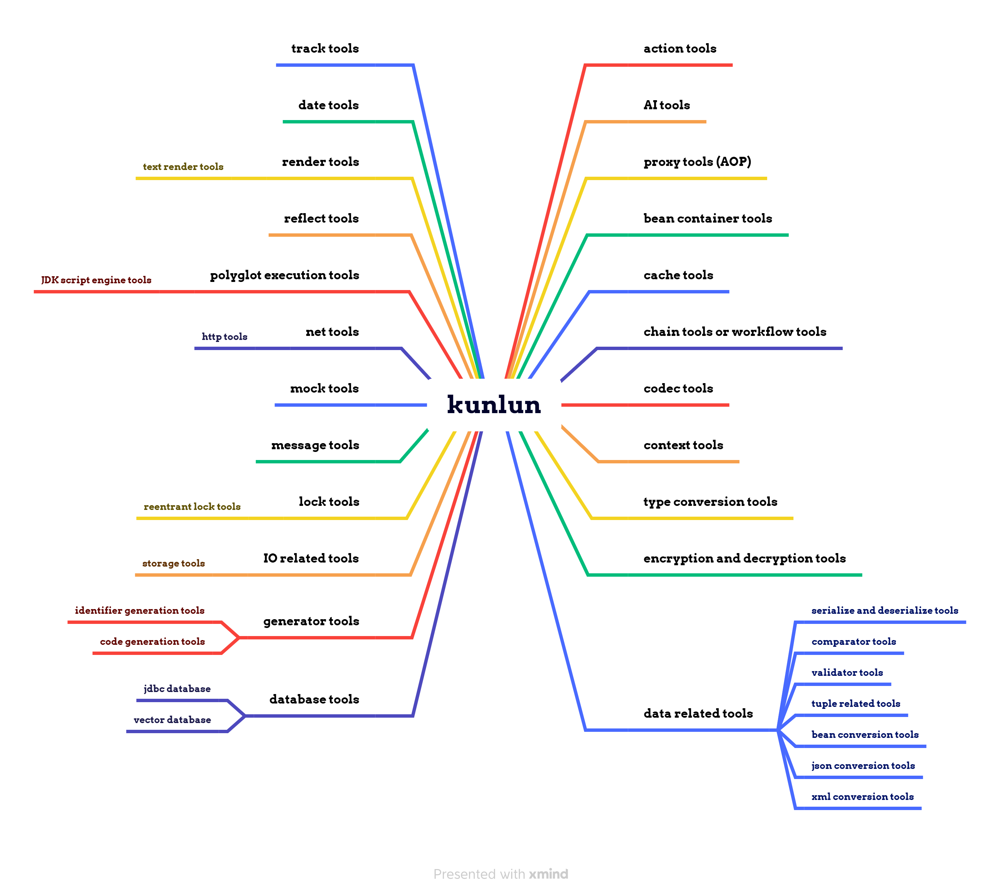

<h1 align="center">Kunlun</h1>
<p align="center"><b>Kunlun 是一个基于门面模式的 Java 技术框架。</b></p>
<p align="center"><b><a href="../../README.md">English</a> | 中文</b></p>

# 简介

Kunlun 是一个基于门面模式的 Java 技术框架。它的设计思想是通过门面模式为使用者提供一个统一的接口去和其他模块交互。使用者不必了解其他模块的实现细节，并且使用者不会和具体的某种实现进行耦合，更利于扩展和维护。
<br /><br /><br />

# 功能图


<br /><br /><br />

# 功能列表
下面会大致介绍一下各个工具的作用及场景。更详细的文档请查看（因为本项目属于“门面”，所以具体的实现类很少，更重要的是其接口和工具类）：https://github.com/kahle23/kunlun-plus 。<br /><br /><br />

## Action Tools（Action 工具）
什么是“Action”呢？其实任何一段程序都可以通过“fun(input) return output;”进行表达，类似于数学上的“f(x)”，在这里我将它定义为“Action”了，然后给予它一个名字。所以不管是极其复杂的逻辑，还是简单的逻辑，都可以通过“Action 名称 + 入参 + 接收出参的变量”进行调用。<br />
<br />
**简单的使用示例（部分示例代码需要进行预先配置或实现）：**

```java
// 假如公司的框架包有两种订单分润算法“order-share1”、“order-share2”
OrderDTO order = ...;
// 订单分润信息计算和填充
ActionUtils.execute("order-share1", order, Object.class);
// 如果想要使用另一种分润算法，只需要修改成如下
ActionUtils.execute("order-share2", order, Object.class);
```
<br /><br /><br />


## AI Tools（AI 工具）
什么是 AI？ AI 即人工智能，是指由人制造出来的系统展现出的智能。这种智能通过学习、理解、推理、解决问题、感知环境、识别语言等方式表现出来。比如 Machine Learning (ML)、Natural Language Processing (NLP)、Optical character recognition (OCR) 等。<br />
<br />
**简单的使用示例（部分示例代码需要进行预先配置或实现）：**

```java
Dict args = Dict.of("model", "gpt-3.5-turbo-0613")
        .set("temperature", 1.9)
        .set("messages", Arrays.asList(
                Dict.of("role", "system").set("content", "You are a helpful assistant."),
                Dict.of("role", "user").set("content", "what is AI?"))
        )
;
String method = "chat";
Dict execute = AiUtils.execute("openai", args, method, Dict.class);
log.info("result: {}", JSON.toJSONString(execute, Boolean.TRUE));
```
<br /><br /><br />


## Proxy Tools（AOP 工具）
代理工具本质上就是动态代理对象生成工具，它是代理设计模式的使用工具。在本项目中仅仅是实现了基于 JDK 的动态代理实现类。<br />
<br />
**简单的使用示例（部分示例代码需要进行预先配置或实现）：**

```java
HelloServiceImpl realHelloService = new HelloServiceImpl();
HelloService helloService = ProxyUtils.proxy(new AbstractInterceptor<HelloServiceImpl>(realHelloService) {
    @Override
    public Object intercept(Object proxyObject, Method method, Object[] args) throws Throwable {
        log.info("Proxy object's class is {}", proxyObject.getClass().getName());
        log.info("Hello, this is intercept. ");
        return method.invoke(getOriginalObject(), args);
    }
});
log.info(helloService.sayHello(name));
```
<br /><br /><br />


## Bean Container Tools（Bean 容器工具）
基于 Bean 容器和依赖反转是一种很好的设计方案，所以就有了这个 Bean 容器工具，为了在没有 Spring 容器的场景下也可以使用 Bean 容器和依赖反转相关功能。<br />
<br />
**简单的使用示例（部分示例代码需要进行预先配置或实现）：**

```java
// 暂无
```
<br /><br /><br />


## Cache Tools（缓存工具）
缓存工具主要用于提高数据访问速度，通过存储频繁使用的数据副本来减少原始存储的检索时间。<br />
<br />
**简单的使用示例（部分示例代码需要进行预先配置或实现）：**

```java
String cacheName = "TEST";
CacheUtils.put(cacheName, "key1", "val1");
CacheUtils.put(cacheName, "key2", "val2");
log.info("{}", CacheUtils.get(cacheName, "key1"));
log.info("{}", CacheUtils.get(cacheName, "key2"));
```
<br /><br /><br />


## Chain Tools or Workflow Tools（链工具或工作流工具）
基于责任链和工作流设计的一套工具。用于应对大部分可以使用责任链或工作流的场景。
比如：
- 审批流程（审批流）；
- 电商系统中的各种活动；

<br /><br />
**简单的使用示例（部分示例代码需要进行预先配置或实现）：**

```java
// 暂无
```
<br /><br /><br />


## Codec Tools（编解码工具）
编解码工具，比如 Base64 编解码、Hex 编解码 和 Unicode 编解码等。<br />
<br />
**简单的使用示例（部分示例代码需要进行预先配置或实现）：**

```java
// Base64 的编码和解码
String encode = CodecUtils.encodeToString(BASE64, dataBytes);
log.info("Encode string: {}{}", NEWLINE, encode);
byte[] decode = CodecUtils.decodeFromString(BASE64, encode);
log.info("Decode string: {}{}", NEWLINE, new String(decode, "UTF-8"));
// Unicode 的编码和解码
String encode = CodecUtils.encode(UNICODE, "Hello，Java! ");
log.info(encode);
log.info(CodecUtils.decode(UNICODE, encode));
```
<br /><br /><br />


## Context Tools（上下文工具）
在做应用服务时，对于当前登陆人的信息等一般都放在上下文工具中。但是在本项目中，上下文工具是一个非常顶层的一个抽象设计。<br />
<br />
**简单的使用示例（部分示例代码需要进行预先配置或实现）：**

```java
// 暂无
```
<br /><br /><br />


## Type Conversion Tools（类型转换工具）
在 Java 中经常会出现这样的场景，比如字符串类型的“16”要转换成数字类型的16（String 16 转换成 Integer 16），当然仅仅是上述的明确的场景，当然很容易。但是当入参是 Object 时，而比如业务操作时是需要拿它做数字计算时呢？亦或者业务操作也仅仅是传入一个期望转换成的类型，这就是一个比较复杂的场景了。
特别是当出现泛型的情况下，将会更加复杂，比如“List<User>”转换成“PageList<Member>”。这就是类型转换工具将要解决的问题。<br />
<br />
**简单的使用示例（部分示例代码需要进行预先配置或实现）：**

```java
// 字符串转换成 Double
Object obj = ConversionUtils.convert("102", double.class);
log.info("{} {}", obj.getClass(), obj);
// 时间字符串转换为 Date 对象
Object obj = ConversionUtils.convert("2019-03-25 10:10:10 300", java.sql.Date.class);
log.info("{} {}", obj.getClass(), DateUtils.format((Date) obj));
```

<br /><br /><br />


## Encryption and Decryption Tools（加解密工具）
加解密工具，比如 AES、DES、DESede、Blowfish、RSA 等。而 Hash 类工具有 MD2、MD5、SHA1、SHA256 等。而 Hmac 类工具有 HmacMD5、HmacSHA1、HmacSHA256 等。<br />
<br />
**简单的使用示例（部分示例代码需要进行预先配置或实现）：**

```java
// 暂无
```
<br /><br /><br />


## Data related Tools（数据相关工具）
数据操作相关工具，比如 序列化和反序列化工具、数据比对工具、元组相关工具等。<br /><br />

### Serialize and Deserialize Tools（序列化和反序列化工具）
序列化工具是将对象转化为可传输或可存储的字节序列，反序列化工具则是将字节序列还原为对象。<br />
<br />
**简单的使用示例（部分示例代码需要进行预先配置或实现）：**

```java
// 暂无
```
<br /><br />

### Comparator Tools（比对工具）
在 Java 中万物皆可对象，所以比对工具可以比对比如图片的差异，文件的差异，两个对象的数据的差异，因为像 List 这种本质上也是对象，所以也可以对比多个对象数据和多个对象数据之间的差异。<br />
<br />
**简单的使用示例（部分示例代码需要进行预先配置或实现）：**

```java
// 暂无
```
<br /><br />

### Validator Tools（验证器工具）
验证某个数据（某个对象）是否符合某个验证器实现类的规则。验证器实现类最经典的就是基于正则的验证器。所以验证器工具就是一套验证比如邮箱、银行卡、手机号等是否“正确”的工具。当然它的最大的优势就是可以很轻松的基于业务进行定制。<br />
<br />
**简单的使用示例（部分示例代码需要进行预先配置或实现）：**

```java
log.info("{}", ValidatorUtils.validate("is_numeric", "-888.666"));
log.info("{}", ValidatorUtils.validate("is_numeric", "hello, world! "));
log.info("{}", ValidatorUtils.validate("regex:email", "hello@email.com"));
log.info("{}", ValidatorUtils.validate("regex:email", "hello@.com"));
log.info("{}", ValidatorUtils.validate("regex:phone_number", "12000000000"));
log.info("{}", ValidatorUtils.validate("regex:phone_number", "18000000000"));
```

<br /><br />

### Tuple related Tools（元组工具）
元组就是比如“KeyValue”、“Pair”和“Triple”等，一些较为方便的用来存储数据的对象。<br />
<br />
**简单的使用示例（部分示例代码需要进行预先配置或实现）：**

```java
KeyValue keyValue = new KeyValueImpl<String, Object>();
Triple triple = new TripleImpl<Object, String, Class<?>>();
```
<br /><br />

### Bean Conversion Tools（Bean 转换工具）
Bean 转换工具是用于不同类型 Java 对象（包含 Map）之间的属性值复制的工具。<br />
<br />
**简单的使用示例（部分示例代码需要进行预先配置或实现）：**

```java
Map<String, Object> personMap = ... ;
User person = ... ;
User user = BeanUtils.mapToBean(personMap, User.class);
User user = BeanUtils.beanToBean(person, User.class);
```

<br /><br />

### Json Conversion Tools（Json 转换工具）
Json 转换工具是用于 Java 对象与 Json 数据之间相互转换的工具。<br />
<br />
**简单的使用示例（部分示例代码需要进行预先配置或实现）：**

```java
String jsonString = JsonUtils.toJsonString("fastjson", data, PRETTY_FORMAT);
String jsonString = JsonUtils.toJsonString("jackson", data, PRETTY_FORMAT);
String jsonString = JsonUtils.toJsonString("gson", data, PRETTY_FORMAT);
```

<br /><br />

### Xml Conversion Tools（XML 转换工具）
XML 转换工具是用于处理和操作 XML 数据的工具，它能实现 XML 数据与 Java 对象之间的转换。<br />
<br />
**简单的使用示例（部分示例代码需要进行预先配置或实现）：**

```java
Object[] arguments = new Object[] {
        new XmlFieldAlias("id", Student.class, "studentId"),
        new XmlFieldAlias("schName", Student.class, "schoolName"),
        new XmlClassAlias("student", Student.class),
        new XmlClassAlias("xml", List.class),
};
String xmlString = XmlUtils.toXmlString(list, arguments);
log.info("\n{}", xmlString);
List<Student> parseList = XmlUtils.parseObject(xmlString, List.class, arguments);
log.info("\n{}", JSON.toJSONString(parseList, true));
```

<br /><br /><br />


## Database Tools（数据库工具）
数据库操作相关工具。<br /><br />

### Jdbc Database Tools（JDBC 数据库工具）
基于原生 JDBC 的数据库操作工具。<br />
<br />
**简单的使用示例（部分示例代码需要进行预先配置或实现）：**

```java
// 暂无
```
<br /><br />

### Vector Database Tools（向量数据库工具）
向量数据库操作工具（无实现类）。<br />
<br />
**简单的使用示例（部分示例代码需要进行预先配置或实现）：**

```java
// 暂无
```
<br /><br /><br />


## Generator Tools（生成器工具）
生成器相关工具。<br /><br />

### Identifier Generation Tools（ID 生成器工具）
ID 生成器工具是用来生成唯一标识符（ID）的工具，它常用于为数据库表中的记录提供主键或唯一标识。<br />
<br />
**简单的使用示例（部分示例代码需要进行预先配置或实现）：**

```java
Long snowflakeId = IdUtils.nextLong("snowflake");
String uuid = IdUtils.nextString("uuid");
```

<br /><br />

### Code Generation Tools（代码生成器工具）
代码生成器工具是用于自动产生代码片段或文件的工具，它主要采用了模板引擎，利用模板填充的方式，将数据填充到预制的代码模板中，用来进行代码生成的。所以它可以生成的代码片段或者代码文件完全取决于预制的代码模板。<br />
<br />
**简单的使用示例（部分示例代码需要进行预先配置或实现）：**

```java
// 暂无
```
<br /><br /><br />


## IO related Tools（IO 相关工具）
IO 相关工具。<br /><br />

### Storage Tools（存储工具）
存储工具是用于存储和管理数据的工具，类似于对象存储服务（Object Storage Service），但也包括了本地存储的功能。<br />
<br />
**简单的使用示例（部分示例代码需要进行预先配置或实现）：**

```java
// This is just an example, and the configuration part is omitted.
File inputFile = new File("/test/input_file.txt");
String testPath = "/test/test_file.txt";
// Save the file to a local folder.
StorageUtils.put("local", testPath, inputFile);
// Save the file to HuaWei cloud OBS.
StorageUtils.put("obs",   testPath, inputFile);
// Save the file to Ali cloud OSS.
StorageUtils.put("oss",   testPath, inputFile);
// Save the file to MinIO.
StorageUtils.put("minio", testPath, inputFile);
```

<br /><br /><br />


## Lock Tools（锁工具）
锁工具主要用于实现多线程间的同步和互斥控制，确保共享资源的安全访问。<br /><br />

### Reentrant Lock Tools（本地可重入锁工具）
基于 Java 的 ReentrantLock 提供的实现，是一种本地可重入的独占锁。<br />
<br />
**简单的使用示例（部分示例代码需要进行预先配置或实现）：**

```java
String managerName = "local", lockName = "testLock";
boolean tryLock = LockUtils.tryLock(managerName, lockName);
Assert.isTrue(tryLock, "Try lock failure! ");
try {
    // Do something.
}
finally {
    LockUtils.unlock(managerName, lockName);
}
```

<br /><br /><br />


## Message Tools（消息工具）
消息工具是用于实现应用程序之间（比如服务端和客户端）或应用程序内部组件之间（A服务和B服务之间）的通信机制（异步或同步）。<br /><br /><br />


## Mock Tools（Mock 工具）
Mock 工具是一种自动化工具，用于创建大量的、格式正确的测试数据，以供软件开发和测试使用。<br />
<br />
**简单的使用示例（部分示例代码需要进行预先配置或实现）：**

```java
Book book = MockUtils.mock(Book.class);
log.info(JSON.toJSONString(book, Boolean.TRUE));
List<Book> bookList = MockUtils.mock(TypeUtils.parameterizedOf(List.class, Book.class));
log.info(JSON.toJSONString(bookList, Boolean.TRUE));
```

<br /><br /><br />


## Net Tools（网络相关工具）
网络相关工具专注于提供网络相关的功能，它的目标是简化网络编程，让开发者能够更轻松地处理网络任务。<br /><br />

### Http Tools（Http 工具）
Http 工具是一种用于发送和接收 HTTP 请求的工具，它提供了与 Web 服务进行通信的能力。<br />
<br />
**简单的使用示例（部分示例代码需要进行预先配置或实现）：**

```java
String testUrl = "https://info.cern.ch";
HttpResponse response = HttpUtils.execute(new SimpleRequest(testUrl, HttpMethod.GET));
log.info(response.getBodyAsString());
```
<br /><br /><br />


## Polyglot Execution Tools（多语言执行工具）
多语言执行工具能在 Java 平台上执行除 Java 本身以外的其他编程语言的机制，例如通过 JVM （Java 虚拟机）上运行的其他语言的解释器或编译器来实现。<br /><br />

### JDK Script Engine Tools（JDK 脚本引擎工具）
JDK 脚本引擎工具是利用了 Java 提供的机制，允许在 Java 应用中执行其他编程语言的代码。<br />
<br />
**简单的使用示例（部分示例代码需要进行预先配置或实现）：**

```java
String script = "a = 2; b = 3;\n" +
                "var c = a + b;\n" +
                "c;";
Dict data = Dict.of("a", 1).set("b", 2);
Object result = PolyglotUtils.eval("nashorn", script, data);
log.info("result: {}", result);
```

<br /><br /><br />


## Reflect Tools（反射工具）
反射工具基于在运行时检查或修改程序结构及行为的机制，而封装的对类、对象、方法和字段等元素进行操作的工具。<br />
<br />
**简单的使用示例（部分示例代码需要进行预先配置或实现）：**

```java
// 暂无
```
<br /><br /><br />


# Render Tools（渲染器工具）
渲染器工具是一种通过定义好的模板来生成动态内容的工具。<br /><br />

### Text Render Tools（文本渲染器工具）
文本渲染器工具（即模板引擎）可以根据预定义的模板和数据来输出格式化的文本或标记语言文档。<br />
<br />
**简单的使用示例（部分示例代码需要进行预先配置或实现）：**

```java
String rendererName = "default";
String template = "\nHello, ${param}! \n" +
                "Hello, ${param1}! \n" +
                "Hello, ${param2}! \n" +
                "Hi, ${param}, ${param}, ${param1}, ${param2}.";
Dict data = Dict.of("param", "World")
        //.set("param1", "Earth")
        .set("param2", new Object());
log.info(RenderUtils.renderToString(rendererName, template, data));
```

<br /><br /><br />


# Date Tools（时间工具）
时间工具主要涉及日期和时间的转换、格式化输出、计算日期间隔以及处理时区问题等。<br />
<br />
**简单的使用示例（部分示例代码需要进行预先配置或实现）：**

```java
// 暂无
```
<br /><br /><br />


# Track Tools（追踪工具）
追踪工具能够监控和记录程序运行时数据的工具，它有助于调试、性能优化和保障系统稳定性，比如埋点、异常告警和操作日志等。<br />
<br />
**简单的使用示例（部分示例代码需要进行预先配置或实现）：**

```java
// 暂无
```
<br /><br /><br />


